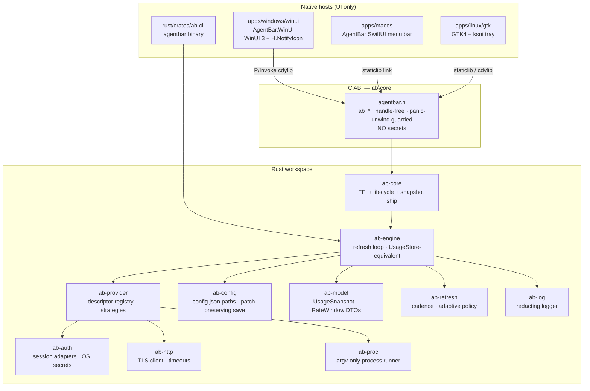
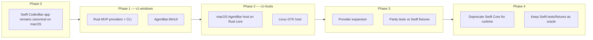
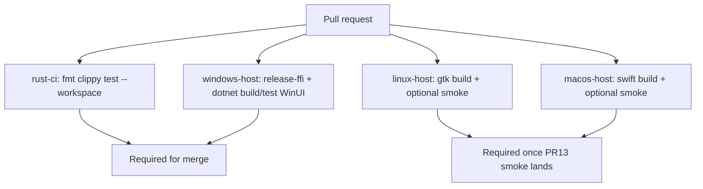
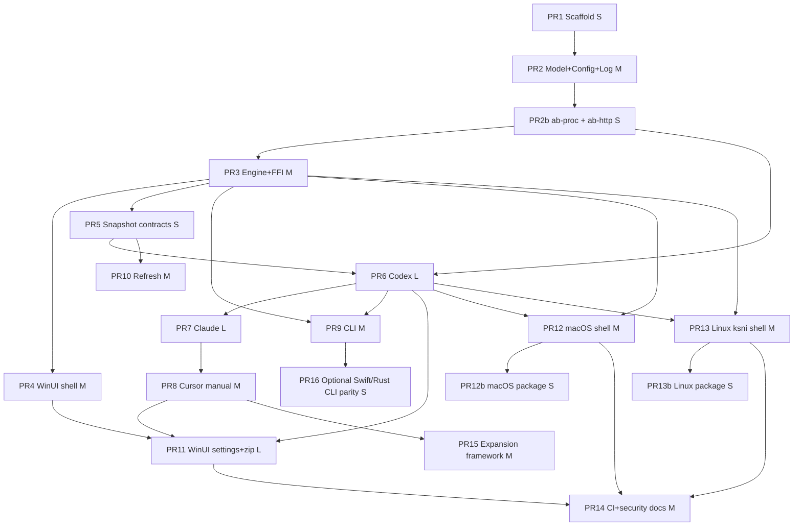

# AgentBar Multiplatform Rust Core

| Field | Value |
| --- | --- |
| **Document title** | AgentBar Multiplatform Rust Core |
| **Author** | _TBD_ |
| **Date** | 2026-07-17 |
| **Status** | Approved (design review consensus, 0 open issues, 2026-07-17) |
| **Product name** | **AgentBar** (final) |
| **Intended GitHub / local path** | `AgentBar` (fork originates from `steipete/CodexBar` MIT; keep dual attribution) |
| **Current local clone** | `C:\Users\usr\CodexBar` (folder rename optional; remote rename not assumed) |
| **Architecture reference** | `C:\Users\usr\DontSpeak` (`ARCHITECTURE.md`, `ds-core` FFI, WinUI host) |
| **License** | MIT — dual attribution: upstream `steipete/CodexBar` + this fork |

---

## Overview

**AgentBar** is a privacy-first menu-bar / tray app that surfaces AI coding-provider usage limits, credits, spend, status, and reset windows **without storing passwords**. It reuses existing provider sessions (OAuth files, device flow, API keys in local config, browser cookies, local app files).

This design rewrites the product as a **structural multi-platform** app, forked from upstream **CodexBar** (`steipete/CodexBar`, MIT) and architected like DontSpeak:

- A single **Rust engine** owns provider probes, config I/O, refresh loop, usage models, and snapshot JSON.
- A small **handle-free C ABI** (`ab-core` / `agentbar.h`, symbols `ab_*`) is the only in-process contract between engine and UI.
- **One native host per OS** links the engine in-process:
  - **Windows:** `AgentBar.WinUI` — WinUI 3 / Windows App SDK (Fluent Win11), tray via H.NotifyIcon.WinUI
  - **macOS:** `AgentBar` — SwiftUI menu-bar host
  - **Linux:** `agentbar` GTK4 tray host
- A **Rust `agentbar` CLI** shares the same core crates (no Swift CLI long-term).

**v1 multiplatform** is deliberately not day-1 parity with all ~59 Swift provider folders. v1 ships: shared Rust core + three native hosts (each must show live MVP snapshot data for ≥1 provider — not empty shells) + CLI + **MVP providers (Codex, Claude, Cursor)** on a pluggable descriptor/strategy architecture. Full provider parity is a post-skeleton roadmap phase.

**Upstream CodexBar** remains the fork source and appears only in migration, attribution, and compatibility sections.

---

## Background & Motivation

### Current state (upstream CodexBar Swift)

| Module | Role |
| --- | --- |
| `Sources/CodexBarCore` | Fetch + parse: Codex RPC/PTY, Claude OAuth/CLI/web, cookies, status, **59** provider folders under `Providers/` |
| `Sources/CodexBar` | State + UI: `UsageStore`, `SettingsStore`, `StatusItemController`, menus, icons |
| `Sources/CodexBarCLI` | Commander-based CLI (also builds for Linux tests) |
| `Sources/CodexBarWidget` | WidgetKit over shared snapshot |
| Helpers | ClaudeWatchdog, ClaudeWebProbe |

Data flow today:

```
background refresh → UsageFetcher / provider probes → UsageStore → menu / icon / widgets
```

Key Swift patterns to port (not abandon):

- **`ProviderDescriptor` + registry** (`ProviderDescriptorRegistry`, 59 provider folders)
- **`ProviderFetchPlan` / strategies** with ordered fallbacks per source mode (`auto` / `web` / `cli` / `oauth` / `api`)
- **Unified snapshots**: `UsageSnapshot`, `RateWindow`, `NamedRateWindow`, credits, optional dashboard extras
- **Config**: `~/.config/codexbar/config.json` (legacy); AgentBar prefers `~/.config/agentbar/config.json` with **read-compat** for CodexBar paths
- **Refresh**: fixed intervals + Adaptive policy (`docs/refresh-loop.md`, pure core in `AdaptiveRefreshPolicyCore`)
- **Privacy**: no passwords; reuse sessions; restrictive config file perms (`0600` on Unix)

### Pain points driving the rewrite

1. **macOS-only app** — Windows and Linux users only get CLI (and CLI lacks native tray UX).
2. **Swift Core is tightly coupled to Apple frameworks** (Keychain Security.framework, WebKit scrapers, NSStatusItem) making a straight port impractical.
3. **Duplication risk** if each platform reimplements probes — usage numbers must match CLI/app across OSes.
4. **Proven pattern exists** in DontSpeak: one Rust engine, tiny C ABI, thin native shells, portable packaging.

### Identity of this fork

This is a **structural rewrite fork**, not a thin feature fork of steipete/CodexBar:

- **Product name:** **AgentBar** (final user decision).
- **Intended repository name:** `AgentBar` (current origin may still be `yanchenko/CodexBar` until a deliberate rename; **do not force-rename remote** without owner confirmation).
- **Dual MIT attribution:** NOTICE/LICENSE retain steipete/CodexBar upstream + fork authors.
- **Swift sources** remain in-tree during migration as the **executable reference + regression oracle**. They are not the long-term runtime for Windows/Linux hosts.
- Fork docs (`docs/FORK_ROADMAP.md`, `docs/UPSTREAM_STRATEGY.md`) describe an earlier identity fork; this design **supersedes multiplatform direction**.

---

## Goals & Non-Goals

### Goals

1. Ship **Rust core** that owns all provider I/O, config I/O, refresh scheduling, and canonical usage snapshots.
2. Ship **three native tray hosts** (WinUI, SwiftUI, GTK4) that only render UI and call the C ABI — each host **must** start the engine and show a live MVP snapshot (or structured auth error) for ≥1 provider.
3. Ship **Rust CLI** `agentbar` with JSON/text output compatible in spirit with upstream CLI (`usage`, `cost`, version).
4. Support **MVP providers**: Codex, Claude, Cursor — with strategy fallbacks that work on Windows without WebKit.
5. **Config compatibility**: AgentBar primary paths + **read-compat** for CodexBar `config.json` shape (version 1, `providers[]`) so users migrate without re-entering keys.
6. **Windows host looks current on Win11**: Mica/acrylic where appropriate, Fluent controls, modern tray flyout (text rows; rich ProgressBars in Settings/Dashboard only).
7. **Privacy-preserving**: no password vault; document session sources per OS honestly; **no secrets over C ABI**.
8. **CI matrix** for rust core + hosts (Windows-first developable without Mac for every step).
9. **Security-conscious** design for cookies, tokens, PTY/CLI helpers, local file reads.
10. **Incremental PRs**, each reviewable; full ~59-provider parity is phased after skeleton.

### Non-Goals (v1)

- Day-1 parity with all ~59 providers, WidgetKit, Sparkle auto-update, or full Adaptive refresh sophistication.
- Replacing upstream steipete macOS app as a drop-in binary for existing Mac users on day one.
- Cross-process daemon architecture (AgentBar v1 stays **in-process only**).
- Storing or syncing credentials to the cloud.
- Browser automation frameworks (Playwright etc.) as default probe path.
- Uniffi / protobuf codegen for the host boundary (hand-written DTOs + contract tests, like DontSpeak `ds-status`).
- Chromium DPAPI auto-import of Cursor cookies (phase 2 research; see Annex C).
- Secrets (apiKey, cookieHeader, tokens) returned or accepted over the C ABI.
- Multi-account Codex managed homes (phase 2).
- Provider endpoint overrides / SSRF-sensitive custom hosts (out of MVP; port validators later).

### Definition of “v1 multiplatform”

Split milestones so empty shells cannot claim product-complete status:

| Capability | v1-windows (primary ship) | v1-hosts (multiplatform bar) |
| --- | --- | --- |
| Rust workspace builds on Windows/macOS/Linux | Yes | Yes |
| C ABI + committed `agentbar.h` | Yes | Yes |
| WinUI tray + settings + **live** snapshot for ≥1 provider | **Required** | Required |
| macOS menu-bar host: engine start + snapshot rows or “auth required” + Settings + Exit | Shell ok early | **Required smoke** |
| Linux GTK4 tray: same live-or-auth smoke | Shell ok early | **Required smoke** |
| CLI `agentbar usage --format json` | Yes | Yes |
| Codex + Claude + Cursor functional on ≥1 realistic auth path each (any host/CI machine) | Yes | Yes |
| Config read/write compatible with v1 schema + CodexBar read-compat | Yes | Yes |
| Packaging smoke (Windows portable zip; macOS/Linux artifacts when 12b/13b land) | Win zip | All three |
| All remaining providers | Roadmap | Roadmap |

---

## Proposed Design

### High-level architecture



### Component responsibilities

| Layer | Owns | Does **not** own |
| --- | --- | --- |
| **ab-\*** Rust crates | Provider HTTP/CLI/file probes, parsing, config file I/O (**sole** merge-patch writer), refresh, snapshot JSON, logging, redaction | Pixel UI, tray icon drawing, OS notification chrome |
| **C ABI (`ab-core`)** | Lifecycle, snapshot wait/json, catalog, paths, reload, host signals, last_error; **path-only** `ab_config_apply_patch_file` (merge in Rust, never returns secret values) | Full config dump get/set; opaque handles; per-widget APIs |
| **WinUI / SwiftUI / GTK** | Tray, menus, settings chrome, icons, notifications, open URLs; Settings builds a **JSON patch file** then calls `ab_config_apply_patch_file` + `ab_engine_reload` | Provider business logic; full-file re-serialize of config; secret config dumps over FFI |
| **CLI** | argv, stdout formats, exit codes; `agentbar config …` calls `ab-config` in-process (same merge-patch) | Tray residency |

### Lifecycle & data flow

```mermaid
sequenceDiagram
  participant UI as Native host
  participant Disk as Config / sessions
  participant FFI as ab-core FFI
  participant Eng as ab-engine
  participant Prov as ab-provider

  Note over UI,Disk: Settings writes a JSON patch file (may contain secrets); Rust merges
  UI->>Disk: write temp patch.json (restricted ACL)
  UI->>FFI: ab_config_apply_patch_file(path)
  FFI->>Eng: ab-config merge-patch into sticky path (preserve unknowns)
  Eng->>Disk: atomic write sticky config.json
  UI->>FFI: ab_engine_reload()
  FFI->>Eng: re-read sticky config from disk
  UI->>FFI: ab_engine_start()
  FFI->>Eng: spawn refresh worker thread(s)
  Eng->>Disk: load sticky config.json
  Eng->>Prov: fetch enabled providers (sync strategies on pool)
  Prov->>Disk: read OAuth / cookies / API keys
  Prov-->>Eng: ProviderUsage[]
  Eng-->>Eng: store snapshot seq++

  loop UI push / poll (background thread)
    UI->>FFI: ab_snapshot_wait(since, timeout_ms)
    FFI->>Eng: block until seq changes or timeout
    Eng-->>FFI: JSON snapshot (no secrets)
    FFI-->>UI: owned char*
    UI->>UI: free via ab_string_free; render tray/menu
  end

  UI->>FFI: ab_refresh_now()
  UI->>FFI: ab_engine_stop()
```

### Crate map (`rust/`)

```
rust/
  Cargo.toml                 # workspace, release + release-ffi profiles
  crates/
    ab-model/                # RateWindow, UsageSnapshot wire types + JSON Schema fixtures
    ab-config/               # Paths (AgentBar + CodexBar compat), load/patch-save, 0600
    ab-log/                  # Structured log + redactor (never log tokens/cookies)
    ab-http/                 # Blocking HTTPS (rustls), timeouts, User-Agent
    ab-proc/                 # Argv-only process runner: timeouts, output caps, no shell
    ab-auth/                 # Session sources: files, optional DPAPI (feature-gated, phase 2)
    ab-provider/             # Sync ProviderStrategy, registry, Codex/Claude/Cursor
    ab-refresh/              # Fixed + Adaptive cadence (port AdaptiveRefreshPolicyCore)
    ab-engine/               # Runtime: schedule, coalesce, snapshot store, worker pool
    ab-core/                 # C ABI (cdylib+staticlib), cbindgen → agentbar.h
    ab-cli/                  # CLI binary name: agentbar (usage, cost, providers, version)
    ab-snapshot/             # Optional: last-good disk snapshot helpers (no secrets)
  deny.toml
  rustfmt.toml
```

**Workspace conventions** (from DontSpeak, adapted):

- Pin `rust-version` explicitly; edition current stable.
- `[profile.release] panic = "abort"`, LTO on.
- `[profile.release-ffi] inherits = "release"`, `panic = "unwind"`, `strip = false` — **required** so `catch_unwind` works in FFI and staticlibs keep symbols for Swift.
- Workspace clippy lints; `undocumented_unsafe_blocks = "warn"`.
- **No tokio / no async_trait for v1.** Blocking I/O + engine-owned worker thread pool only.

### C ABI (`agentbar.h` / `ab-core::ffi`)

Design rules (copy DontSpeak `dontspeak.h` contract; **stricter on config**):

- **Handle-free** — no create/destroy pair; process-global engine state.
- **Owned strings** — every returned `char*` is heap UTF-8; free only with `ab_string_free`. Never NULL; failures return `"{}"` / `"[]"` / `""`.
- **u8 status** — `1` success / `0` failure; no negative codes.
- **Panic fence** — every `extern "C"` uses `catch_unwind`; `release-ffi` forces `panic = "unwind"`.
- **No secret *returns* over FFI** — ABI never returns apiKey, cookieHeader, tokens, or full config dumps. Settings may pass a **filesystem path** to a host-written patch file (`ab_config_apply_patch_file`); Rust performs merge-patch via `ab-config` and returns only u8 success. Snapshot JSON and catalog JSON **never** contain secrets.
- **Thread-safety contract:**
  - All `ab_*` calls may be issued from any host thread.
  - `ab_snapshot_wait` **blocks** — call only from a dedicated background thread (never UI thread).
  - `ab_engine_stop` may be concurrent with wait: wait returns promptly (`"{}"` or last snapshot); stop joins workers.
  - Process-global state is mutex-guarded; reentrancy: nested `ab_engine_start` is idempotent; CLI and GUI are **separate processes** (each has its own engine) — see K15 for multi-process rules.
  - In-process: do not call FFI re-entrantly from inside a wait callback (hosts must not).

#### v1 required vs deferred ABI matrix

| Symbol | v1 | Blocks? | Notes |
| --- | --- | --- | --- |
| `ab_engine_start` | **Required** | No (spawns workers) | Idempotent |
| `ab_engine_stop` | **Required** | May block briefly (join) | Safe on Exit |
| `ab_engine_reload` | **Required** | Short (disk read) | Re-read config from disk; no JSON body |
| `ab_engine_running` | **Required** | No | |
| `ab_refresh_now` | **Required** | No | Coalesces; work on pool |
| `ab_set_refresh_interval_secs` | **Required** | No | Validates enum set (below); `0` = manual |
| `ab_set_adaptive_refresh` | **Required** | No | |
| `ab_note_menu_opened` | **Required** | No | Adaptive signal |
| `ab_set_host_signals_json` | **Required** | No | `{ "lowPower": bool, "thermalSerious": bool }` — empty/`{}` = no signals |
| `ab_snapshot_json` | **Required** | No | Current; `"{}"` if empty |
| `ab_snapshot_wait` | **Required** | **Yes** | Background thread only |
| `ab_config_path` | **Required** | No | **Sticky write target** (see Config sticky path); path string only, never file contents |
| `ab_config_apply_patch_file` | **Required** | Short (disk) | Host path to JSON patch; Rust merge-patch into sticky path; **returns u8 only** (never echoes secrets) |
| `ab_log_dir` | **Required** | No | Directory for “Open log folder” |
| `ab_data_dir` | **Required** | No | OS data root used by engine |
| `ab_providers_catalog_json` | **Required** | No | Includes `dashboardURL`, `statusPageURL`, labels — **no secrets** |
| `ab_version` | **Required** | No | |
| `ab_last_error_json` | **Required** | No | Structured DTO (below) |
| `ab_string_free` | **Required** | No | |
| `ab_config_json` / `ab_config_set_json` | **Rejected** | — | Would return/accept full secretful config over FFI |
| `ab_config_public_json` (redacted) | Deferred v1.1 | No | Optional display aid only |

```c
/* agentbar.h — stable C ABI (sketch; cbindgen from ab-core/src/ffi.rs) */

#include <stdint.h>

/* Lifecycle */
uint8_t  ab_engine_start(void);
uint8_t  ab_engine_stop(void);
uint8_t  ab_engine_reload(void);          /* re-read config from disk */
uint8_t  ab_engine_running(void);

/* Refresh */
uint8_t  ab_refresh_now(void);
uint8_t  ab_set_refresh_interval_secs(uint32_t secs); /* see allowed set; 0 = manual */
uint8_t  ab_set_adaptive_refresh(uint8_t on);
void     ab_note_menu_opened(void);
uint8_t  ab_set_host_signals_json(const char* json);  /* lowPower / thermalSerious */

/* Snapshot (JSON; see ab-model schema v1 — NEVER secrets) */
char*    ab_snapshot_json(void);
char*    ab_snapshot_wait(uint64_t since_seq, uint32_t timeout_ms);

/* Paths (not file contents) */
char*    ab_config_path(void);          /* sticky write target after resolve/load */
char*    ab_log_dir(void);
char*    ab_data_dir(void);

/* Config mutation — path-only; merge in Rust; never returns secret values */
uint8_t  ab_config_apply_patch_file(const char* patch_path);

/* Catalog (static registry metadata + URLs; not secrets) */
char*    ab_providers_catalog_json(void);

/* Status / health */
char*    ab_version(void);
char*    ab_last_error_json(void);  /* {"code","message","providerId?", "at"} or "{}" */

/* Memory */
void     ab_string_free(char* s);
```

**`ab_config_apply_patch_file` contract:**

- `patch_path` is an absolute path to a UTF-8 JSON object written by the host (or CLI).
- Patch is a **shallow/deep merge document**, not a full config replacement. Typical shapes:
  - `{ "providers": [ { "id": "cursor", "enabled": true, "cookieSource": "manual", "cookieHeader": "…" } ] }` — merge by `providers[].id`
  - `{ "providers": [ { "id": "codex", "enabled": true } ] }` — toggles only; sibling keys on that object preserved
- Implementation: load sticky config as raw JSON → merge patch per Host config mutation rules → atomic write sticky path → return `1`/`0`.
- On success the host should call `ab_engine_reload()` (or apply_patch may reload if engine running — document: **caller must reload** for v1 simplicity).
- Patch file should use user-only ACL; host **deletes** the temp patch after apply (best-effort).
- Failure sets `ab_last_error_json` (`config.patch_invalid`, `config.io`, …).

**`ab_last_error_json` shape (locked):**

```json
{
  "code": "provider.auth_missing",
  "message": "Claude credentials not found",
  "providerId": "claude",
  "at": "2026-07-17T12:00:00Z"
}
```

Hosts use this for structured toasts. Codes are stable strings (`engine.*`, `config.*`, `provider.*`).

Rust side patterns (cite DontSpeak `ds-core/src/ffi.rs`):

```rust
#[cfg(panic = "abort")]
compile_error!("ab-core must build with panic=unwind (profile release-ffi)");

#[no_mangle]
pub extern "C" fn ab_engine_start() -> u8 {
    guard_val(0, || engine::start() as u8)
}
```

### Snapshot JSON contract (schema v1)

Single source of truth in `ab-model`, shipped as versioned JSON Schema + golden fixtures. Hosts hand-write DTOs (C# records / Swift structs / Rust serde for CLI). **Contract tests** round-trip fixtures (DontSpeak `ds-status` pattern). **Host DTO fields ⊆ schema.**

#### Wire format policy

| Policy | Decision |
| --- | --- |
| Field naming | camelCase (Swift Codable migration ease) |
| Optional fields | **Omit** when absent — **never emit JSON `null`** for optional snapshot fields |
| `error` / `errorCode` | **Omit both when OK** (success). When failed: emit non-empty `error` string; emit `errorCode` when known. **Never** `"error": null` |
| Unknown fields on deserialize | Hosts **ignore-unknown**; core may emit additive fields later |
| NaN/Inf | Finite f64 only; NaN/Inf → `0.0` |
| Secrets | **Never** in snapshot |
| Version | Root `"schemaVersion": 1` |

#### Root snapshot

| Field | Type | MVP required | Notes |
| --- | --- | --- | --- |
| `schemaVersion` | u32 | Yes | Always `1` |
| `seq` | u64 | Yes | Monotonic for wait loops |
| `updatedAt` | ISO-8601 string | Yes | Engine last recompute |
| `refreshing` | bool | Yes | |
| `providers` | array | Yes | May be empty array |

#### Provider entry (MVP-required vs ignore-unknown)

| Field | Type | MVP required | Mapping from Swift |
| --- | --- | --- | --- |
| `id` | string | Yes | `UsageProvider.rawValue` |
| `enabled` | bool | Yes | Config enable flag at fetch time |
| `sourceLabel` | string? | Yes if known | e.g. `oauth`, `cli`, `web`, `api` |
| `updatedAt` | ISO-8601 | Yes | Per-provider stamp |
| `error` | string? | **Only when failed** | Omit when OK; never null. Human-readable |
| `errorCode` | string? | **Only when failed + known** | e.g. `auth_missing`; omit when OK |
| `primary` | RateWindow? | Yes if any window | Omit object when absent |
| `secondary` | RateWindow? | Optional | Omit when absent |
| `tertiary` | RateWindow? | Optional | Omit when absent |
| `extraRateWindows` | NamedRateWindow[] | Optional | Omit when empty |
| `creditsRemaining` | f64? | Optional | Codex credits etc.; omit when absent |
| `accountLabel` | string? | Optional | Email/org display; not a secret token |
| `dataConfidence` | string? | Optional | `exact` \| `estimated` \| `percentOnly` \| `unknown` |
| `cursorRequests` | object? | **MVP optional for Cursor** | Thin DTO on hosts; omit when absent. See `CursorRequestsDto` |
| Provider-specific blobs (kiro, amp, zai, …) | — | **Dropped for MVP** | Ignore-unknown if ever added later |

**`cursorRequests` thin shape (schema v1, Cursor only):**

| Field | Type | Notes |
| --- | --- | --- |
| `included` | f64? | Plan included request units if known |
| `used` | f64? | Used units |
| `remaining` | f64? | Remaining units |
Omit the whole `cursorRequests` object when none of the fields are known. Hosts include `CursorRequestsDto?` so PR5 fixtures can lock the field without ad-hoc `JsonElement` parsing. Primary/secondary RateWindows remain the tray/menu source of truth if requests detail is missing.

#### RateWindow (parity with Swift `RateWindow`)

| Field | Type | Required | Notes |
| --- | --- | --- | --- |
| `usedPercent` | f64 | Yes | |
| `windowMinutes` | i64? | Optional | |
| `resetsAt` | ISO-8601? | Optional | |
| `resetDescription` | string? | Optional | Claude CLI scrape text |
| `nextRegenPercent` | f64? | Optional | Rolling recovery; Claude may need |
| `isSyntheticPlaceholder` | bool | Default false | **Omit when false**; true only when synthetic. Menu metrics must not treat placeholder as real session lane |

#### NamedRateWindow

| Field | Type | Notes |
| --- | --- | --- |
| `id` | string | |
| `title` | string | |
| `window` | RateWindow | |
| `usageKnown` | bool | Default true; omit when true |

Illustrative complete example:

```json
{
  "schemaVersion": 1,
  "seq": 42,
  "updatedAt": "2026-07-17T12:00:00Z",
  "refreshing": false,
  "providers": [
    {
      "id": "codex",
      "enabled": true,
      "sourceLabel": "oauth",
      "updatedAt": "2026-07-17T12:00:00Z",
      "primary": {
        "usedPercent": 42.5,
        "windowMinutes": 300,
        "resetsAt": "2026-07-17T17:00:00Z"
      },
      "secondary": {
        "usedPercent": 10.0,
        "windowMinutes": 10080
      },
      "creditsRemaining": 12.5,
      "accountLabel": "user@example.com",
      "dataConfidence": "exact"
    },
    {
      "id": "claude",
      "enabled": true,
      "sourceLabel": "oauth",
      "updatedAt": "2026-07-17T12:00:00Z",
      "primary": {
        "usedPercent": 0.0,
        "windowMinutes": 300,
        "isSyntheticPlaceholder": true
      },
      "secondary": {
        "usedPercent": 55.0,
        "windowMinutes": 10080,
        "resetsAt": "2026-07-24T12:00:00Z",
        "nextRegenPercent": 2.5
      }
    },
    {
      "id": "cursor",
      "enabled": true,
      "sourceLabel": "web",
      "updatedAt": "2026-07-17T12:00:00Z",
      "errorCode": "auth_missing",
      "error": "Cursor cookie not configured (cookieSource=manual required)"
    }
  ]
}
```

### Provider trait design (sync / blocking)

**v1 decision: sync trait only.** Delete any `async_trait` sketches. Engine owns a worker thread pool; strategies perform blocking I/O.

```rust
/// Stable provider id — wire string matches upstream UsageProvider.rawValue where possible.
#[derive(Clone, Copy, Debug, PartialEq, Eq, Hash, Serialize, Deserialize)]
#[serde(rename_all = "lowercase")]
pub enum ProviderId {
    Codex,
    Claude,
    Cursor,
}

pub struct ProviderMetadata {
    pub id: ProviderId,
    pub display_name: &'static str,
    pub default_enabled: bool,
    pub supports_credits: bool,
    pub source_modes: &'static [SourceMode],
    pub session_label: &'static str,
    pub weekly_label: &'static str,
    pub dashboard_url: Option<&'static str>,
    pub status_page_url: Option<&'static str>,
}

/// Sync strategy — runs on engine worker threads only.
pub trait ProviderStrategy: Send + Sync {
    fn id(&self) -> &str;           // e.g. "codex.oauth"
    fn kind(&self) -> StrategyKind; // OAuth | Cli | Web | Api | Local
    fn is_available(&self, ctx: &FetchContext) -> bool;
    fn fetch(&self, ctx: &FetchContext) -> Result<ProviderFetchResult, ProviderError>;
    fn should_fallback(&self, err: &ProviderError, ctx: &FetchContext) -> bool;
}

pub struct ProviderDescriptor {
    pub meta: ProviderMetadata,
    pub resolve: fn(&FetchContext) -> Vec<Box<dyn ProviderStrategy>>,
}
```

**Fetch scheduling (engine):**

| Rule | Decision |
| --- | --- |
| Parallelism | **Parallel** enabled providers (one task each on pool); strategies within a provider run **sequential** fallback order |
| Per-provider timeout | Default **45s** wall clock (configurable later); cancel cooperative via `FetchContext::deadline` |
| Global refresh budget | Coalesce: single `is_refreshing` gate; overlapping `ab_refresh_now` no-ops |
| Cancellation on `ab_engine_stop` | Set cancel flag; pool tasks check deadline/cancel between strategies; join with timeout then abandon |
| Probe timeouts | `ab-http` default connect 10s / request 30s; `ab-proc` default 30s + output cap 2 MiB |

**FetchContext** carries: source mode, env map, resolved provider config slice (including secrets **in-process only**), deadlines, redacting logger — **not** UI objects.

Registry: static list (MVP three descriptors). Unknown `providers[].id` in config → log + skip (Swift already does this); **never delete** unknown provider objects on save (see Config).

### MVP provider matrix

| Provider | Priority strategies (v1) | Windows realism | defaultEnabled | Notes |
| --- | --- | --- | --- | --- |
| **Codex** | 1) OAuth via `auth.json` 2) CLI RPC `codex app-server` if on PATH | High | **true** | Web dashboard / WebKit extras out; multi-home out |
| **Claude** | 1) File `~/.claude/.credentials.json` 2) API/Admin key from config 3) `claude` CLI probe 4) Keychain **macOS only** | High for file+API | **false** (match Swift) | No PTY web scrape v1; delegated CLI refresh optional |
| **Cursor** | 1) **Manual** `cookieHeader` + `cookieSource=manual` only | High if user pastes cookie | **false** | Chromium DPAPI = **phase 2 research only** |

See **Annexes A–C** for implementer detail.

### Config compatibility

#### Path resolution order (read)

1. `AGENTBAR_CONFIG` absolute path if set  
2. Legacy `CODEXBAR_CONFIG` absolute path if set (compat)  
3. `$XDG_CONFIG_HOME/agentbar/config.json` if `XDG_CONFIG_HOME` absolute **and file present**  
4. `~/.config/agentbar/config.json` if present  
5. `$XDG_CONFIG_HOME/codexbar/config.json` if present (CodexBar compat)  
6. `~/.config/codexbar/config.json` if present (CodexBar compat)  
7. Legacy `~/.codexbar/config.json` if present  
8. Else **create path** (not yet on disk): `~/.config/agentbar/config.json` (or `$XDG_CONFIG_HOME/agentbar/config.json` if XDG absolute)

Windows: `~` → user profile (`%USERPROFILE%\.config\agentbar\config.json`). Prefer home-relative `.config` on all platforms for cross-tool consistency.

#### Sticky path + save destination (locked — K22)

| Rule | Decision |
| --- | --- |
| **Sticky path** | After resolve (steps 1–8), the engine binds a **sticky path** = the path used for the last successful load, or the create path (step 8) if nothing existed. |
| **`ab_config_path`** | Always returns the **sticky write target** (same path all saves use), never a different “read-only discover” path. |
| **All saves** | CLI, `ab_config_apply_patch_file`, and first-create defaults write **only** to the sticky path. **No dual-write.** |
| **Both AgentBar + CodexBar files exist** | Read order prefers AgentBar (steps 3–4 before 5–7). Sticky = AgentBar path. Log a one-shot warning: CodexBar config is **ignored for read/write** while AgentBar file exists (risk of drift if user edits the old file by hand). |
| **Only CodexBar file exists** | Sticky = that CodexBar/legacy path. Saves stay **in place** (do not silently invent a second AgentBar file). |
| **One-time migrate (optional, explicit)** | `agentbar config migrate` or Settings “Copy config to AgentBar path”: copy sticky content → `~/.config/agentbar/config.json`, rebind sticky to AgentBar path, **do not delete** the old file (user may keep CodexBar app). Never dual-write after migrate. |
| **Env overrides** | If `AGENTBAR_CONFIG` or `CODEXBAR_CONFIG` is set, sticky is that absolute path for the process lifetime (no auto-migrate). |

PR2 unit matrix: env override; agentbar-only; codexbar-only sticky-in-place; both present → agentbar sticky + warning; create default; migrate rebind.

#### Write policy (critical — unknown-key preservation)

Swift `CodexBarConfig` uses closed CodingKeys and does **not** re-emit unknown top-level keys. AgentBar **improves** migration safety inside **`ab-config` only** (single implementation):

1. **Load as raw `serde_json::Value`** first.  
2. Overlay / validate **known** fields (`version`, `providers[]` entries we understand).  
3. **Write back preserving**:
   - Unknown top-level keys  
   - Entire provider objects for ids not in the MVP registry (including their `apiKey` / `cookieHeader`)  
   - Known provider objects’ **sibling** keys not mentioned in the patch  
   - `hooks` subtree round-trip **without execution** (schema-compatible; execution deferred — K18)  
4. **Merge-patch only** — never “serialize full typed model from partial registry.”  
5. Golden test (Rust PR2): config with 10 providers + secrets → enable only Codex → save → other providers’ keys and `hooks` intact.

Other write rules:

- Atomic write (temp + rename) to sticky path.  
- Unix mode `0600`. Windows: ACL restricted to current user best-effort.  
- Never log `apiKey` / `cookieHeader` values.  
- Provider enable lists: only fields present in the patch change; do not strip sibling fields.

UI-only settings (icon style, window positions) live in platform stores (WinUI `ApplicationData`, UserDefaults, GSettings) **or** non-secret `ui.json` beside config — keep secrets out of UI stores.

Defaults on first create: **Codex enabled**; Claude/Cursor disabled (match Swift metadata).

#### Host config mutation contract (locked — K5)

**Problem:** Config is off the secret-returning C ABI. If WinUI/Swift/GTK deserialize into MVP-only typed models and re-serialize the whole file, unknown providers / `hooks` / sibling secrets are destroyed.

**Rule: hosts must not full-rewrite `config.json` via typed MVP serializers.**

| Path | Who | How |
| --- | --- | --- |
| **Primary (GUI hosts)** | WinUI / SwiftUI / GTK | Build a **minimal JSON patch object** (only fields the user changed) → write to a temp file with user-only ACL → `ab_config_apply_patch_file(path)` → delete temp → `ab_engine_reload()`. |
| **Primary (CLI / scripts)** | `agentbar` | `agentbar config path`, `agentbar config patch --file <path>`, `agentbar config set-provider <id> --enabled true` (etc.) — all call **`ab-config` merge-patch** in-process. |
| **Forbidden** | Any host | Load config with a typed model that only knows Codex/Claude/Cursor → `JsonSerializer.Serialize` / `JSONEncoder` full document → overwrite sticky path. |
| **Display of secrets in Settings** | Host | For fields the user is editing, host may keep values **only in memory for that session** after the user pastes them, or re-read from disk via **host-local** raw JSON open of sticky path (never via FFI dump). Prefer showing masked placeholders (`••••`) and only writing when the user changes a field. |

**Mandatory preserve rules** (enforced in Rust merge; hosts must not bypass):

1. Unknown top-level keys preserved.  
2. `providers[]` entries whose `id` is absent from the patch are preserved verbatim.  
3. For a patched provider id: deep-merge object keys; unmentioned siblings (e.g. `apiKey` when only `enabled` changes) preserved.  
4. `hooks` subtree preserved unless the patch explicitly includes `hooks`.  
5. Atomic write + permissions as above.

**Tests:**

| Test | PR |
| --- | --- |
| Rust golden: 10 providers + hooks + secrets → patch enable Codex only | PR2 |
| C# host integration: call apply_patch_file (or CLI) path; assert unknown keys survive — **must not** use typed full rewrite | PR11 |
| Optional Swift/GTK same golden once hosts land | PR12 / PR13 |

Settings UI “Reveal config path” uses `ab_config_path` (sticky). “Open log folder” uses `ab_log_dir`.

### Refresh loop (core)

Port pure policy from `Sources/AdaptiveRefreshCore/AdaptiveRefreshPolicyCore.swift` and `docs/refresh-loop.md` into `ab-refresh`.

**Fixed intervals** accepted by `ab_set_refresh_interval_secs` (match Swift `RefreshFrequency`):

| Label | Seconds |
| --- | --- |
| Manual | `0` |
| 1 minute | `60` |
| 2 minutes | `120` |
| 5 minutes | `300` (default) |
| 15 minutes | `900` |
| 30 minutes | `1800` |
| Adaptive | use `ab_set_adaptive_refresh(1)` (not a fixed seconds value) |

Reject other positive values → return `0` and set last_error.

**Adaptive table:**

| Condition | Delay | Reason |
| --- | --- | --- |
| Low power / thermal serious (`ab_set_host_signals_json`) | 30m | constrained |
| Menu opened &lt; 5m | 2m | recentInteraction |
| 5m–1h | 5m | warm |
| 1–4h | 15m | idle |
| else | 30m | longIdle |

Hosts call `ab_note_menu_opened()` and should call `ab_set_host_signals_json` when WinRT/IOKit/etc. signals are available; if omitted, adaptive degrades to warm/idle heuristics only (still valid).

Coalesce concurrent refreshes (`is_refreshing` guard).

### Host app skeletons

#### Repository layout (target)

```
AgentBar/   # or CodexBar/ until local rename
  rust/                          # engine + CLI
  apps/
    windows/
      winui/                     # AgentBar.WinUI.csproj
      installer/                 # build-portable.ps1
      winui.tests/
    macos/                       # SwiftPM app linking libab_core.a → AgentBar.app
    linux/gtk/                   # GTK4 + ksni host → agentbar binary
  Sources/                       # LEGACY Swift CodexBar (reference during migration)
  docs/
    design/
      multiplatform-rust-core.md # this document
  .github/workflows/
    rust-ci.yml
    windows-host.yml
    macos-host.yml
    linux-host.yml
```

#### Windows (primary development host)

Match DontSpeak currency (`DontSpeak/apps/windows/winui/DontSpeak.WinUI.csproj`):

| Item | Value |
| --- | --- |
| TFM | `net10.0-windows10.0.19041.0` |
| WindowsAppSDK | `2.2.0` (or newer stable when packaging) |
| Tray | `H.NotifyIcon.WinUI` **2.4.2-dev.22** or newer with bottom-taskbar fix; `ContextMenuMode.SecondWindow` |
| Packaging | Unpackaged `WindowsPackageType=None` |
| **Dev build** | Framework-dependent OK (`WindowsAppSDKSelfContained=false`) — needs local .NET / WinAppSDK |
| **Portable publish** | `build-portable.ps1`: `--self-contained` + `WindowsAppSDKSelfContained=true` → zip for clean Win11 VM |
| Engine DLL | `ab_core.dll` from `cargo build --profile release-ffi -p ab-core` |
| P/Invoke | `Native.cs` mirroring DontSpeak `Native.cs` |
| Identity | Assembly/product name **AgentBar**; exe `AgentBar.exe` (or `AgentBar.WinUI.exe`); FileDescription AgentBar |
| Look | Fluent Win11: Mica on Settings/Dashboard window |

**UI surfaces (v1) — tray vs window split:**

1. **Tray icon** — single icon; color/overlay for “any provider exhausted” / error dim; tooltip with primary % summary.  
2. **Context flyout (MenuFlyout)** — **text-only** `MenuFlyoutItem` rows (DontSpeak style): e.g. `Codex  42% · resets 3h`, `Claude  auth required`, then Refresh / Settings / Exit. **No ProgressBars inside H.NotifyIcon flyout** (WinUI MenuFlyout is not a free-form data UI).  
3. **Settings / Dashboard window** — NavigationView: General (refresh), Providers (enable, source mode, paste cookie/API key via **JSON patch file + `ab_config_apply_patch_file`** — never full-file typed rewrite), Advanced (reveal sticky config path, open log folder via `ab_log_dir`, optional migrate). **ProgressBars, multi-window detail, history live here only.**  
4. **Merge mode** — v1 single tray only; multi-icon later.

**Packaging:**

- `apps/windows/installer/build-portable.ps1` — cargo release-ffi + `dotnet publish --self-contained` + zip `agentbar-<ver>-windows-x86_64.zip`.  
- Optional MSIX later (non-goal for v1).  
- No model downloads; zip stays small.

**Single-instance (K14):** second start focuses existing Settings window / balloon; do not spawn second tray icon. Use a named mutex `Local\AgentBar-WinUI-SingleInstance`.

#### macOS

- SwiftUI `LSUIElement` app **AgentBar**; status item(s).  
- Link `libab_core.a` via SwiftPM C target (pattern: DontSpeak `CDontSpeak`).  
- Bundle id distinct from legacy CodexBar app during dual-stack (e.g. `app.agentbar.AgentBar` vs upstream/legacy).  
- Initially thinner than full upstream UI: one menu (text usage lines), settings scene, no WidgetKit.  
- **Smoke acceptance:** engine start + snapshot rows or auth-required + settings + exit.  
- Legacy `Sources/CodexBar` coexists until feature depth goals are met; document dual-app for users (side-by-side OK).

#### Linux

- GTK4 main loop + **ksni** StatusNotifierItem on a **dedicated thread** (DontSpeak `tray.rs` pattern: async-channel to GTK; never touch GTK from tray DBus thread).  
- **Not** GTK StatusIcon (removed).  
- Fallback when no SNI host: window-only mode + log warning (still useful on headless CI as build-only).  
- CI: build-required; xvfb optional for interactive smoke; packaging via tarball + `.desktop` + rpath/lib next to binary.  
- Binary name: `agentbar` (or `agentbar-gtk`).

### Windows session / credential realism

| Source | v1 | Approach |
| --- | --- | --- |
| `~\.codex\auth.json` (`CODEX_HOME`) | Yes | Direct file read |
| API keys in `config.json` | Yes | Disk only; never over FFI |
| Manual Cookie header in config | Yes | Primary Cursor path |
| Chrome/Edge cookies (DPAPI / ABE) | **Phase 2 research** | Feature-gated; not MVP acceptance |
| Windows Credential Manager | Later | Tokens we store ourselves |
| Cursor local storage reverse-engineer | No v1 | Prefer manual cookie |
| WebKit scrape | No v1 | Defer |
| macOS Keychain OAuth (Claude) | macOS host only | Windows/Linux: file + API + CLI |

**Privacy stance:**

- AgentBar never asks for provider passwords.  
- Cookie paste is local-only; Advanced can set cookieSource off.  
- Config may contain secrets → restrictive ACLs + redacted logs.  
- Crash dumps: avoid lingering secret copies in managed strings from FFI (none shipped).

### Migration from Swift CodexBarCore



Practical rules:

1. Port **parsers** with unit fixtures from `Tests/` and `docs/*` provider pages.  
2. Auth sources per OS in annexes + existing `docs/codex.md`, `docs/claude.md`, `docs/cursor.md`.  
3. Dual-run comparison: `agentbar usage --format json` (Rust) vs Swift CLI on macOS CI for MVP providers (scheduled PR).  
4. Do not delete Swift sources until Rust coverage checklist is signed off.

### Testing strategy

| Layer | What |
| --- | --- |
| Unit | Parsers, rate window math, config patch-preserve, adaptive policy, redaction |
| Integration | Provider strategies against `httpmock` (no real network in CI) |
| Contract | Snapshot JSON fixtures shared by Rust + C# + Swift host DTOs |
| Host smoke | Each host: start engine, show live or auth-required row for ≥1 provider |
| Security | Config ACL; redaction; path traversal; secrets never in snapshot/logs/FFI |
| Manual QA | Live provider matrix on developer machines only |

### CI strategy



- **Windows developable without Mac**: PRs that only touch `rust/` + `apps/windows/` fully validatable on Windows.  
- `cargo deny` periodic (DontSpeak pattern).

### Observability

- Logs: `%APPDATA%/AgentBar/logs/` (Windows), `~/Library/Logs/AgentBar/` (macOS), `~/.local/share/agentbar/logs/` (Linux) — exposed via `ab_log_dir`.  
- Categories: `refresh`, `provider.<id>`, `config`, `ffi`, `auth` (success/fail + source kind only).  
- Optional in-memory refresh duration for Settings debug.  
- No telemetry upload in v1.

---

## API / Interface Changes

### New public surfaces

1. **C ABI** `agentbar.h` (`ab_*`) — above.  
2. **CLI** (Rust):

```
agentbar usage [--format text|json] [--provider codex] [--pretty]
agentbar providers
agentbar config path
agentbar config patch --file <path>     # ab-config merge-patch → sticky path
agentbar config set-provider <id> [--enabled true|false] [--source-mode auto|…] 
agentbar config migrate                 # optional: copy sticky → ~/.config/agentbar + rebind
agentbar version
agentbar cost   # local session scan when implemented
```

3. **Config schema**: v1-compatible with CodexBar; additive fields; merge-patch-preserving save via `ab-config` only.

### Host-facing snapshot DTO (C# — must match schema)

```csharp
public sealed record SnapshotDto(
    [property: JsonPropertyName("schemaVersion")] int SchemaVersion,
    [property: JsonPropertyName("seq")] ulong Seq,
    [property: JsonPropertyName("updatedAt")] string UpdatedAt,
    [property: JsonPropertyName("refreshing")] bool Refreshing,
    [property: JsonPropertyName("providers")] ProviderSnapDto[] Providers);

public sealed record ProviderSnapDto(
    [property: JsonPropertyName("id")] string Id,
    [property: JsonPropertyName("enabled")] bool Enabled,
    [property: JsonPropertyName("sourceLabel")] string? SourceLabel,
    [property: JsonPropertyName("updatedAt")] string? UpdatedAt,
    // Omit from JSON when OK — use JsonIgnoreCondition.WhenWritingNull on serialize of core fixtures;
    // hosts deserialize missing as null in C# without requiring wire nulls.
    [property: JsonPropertyName("error")] string? Error,
    [property: JsonPropertyName("errorCode")] string? ErrorCode,
    [property: JsonPropertyName("primary")] RateWindowDto? Primary,
    [property: JsonPropertyName("secondary")] RateWindowDto? Secondary,
    [property: JsonPropertyName("tertiary")] RateWindowDto? Tertiary,
    [property: JsonPropertyName("extraRateWindows")] NamedRateWindowDto[]? ExtraRateWindows,
    [property: JsonPropertyName("creditsRemaining")] double? CreditsRemaining,
    [property: JsonPropertyName("accountLabel")] string? AccountLabel,
    [property: JsonPropertyName("dataConfidence")] string? DataConfidence,
    [property: JsonPropertyName("cursorRequests")] CursorRequestsDto? CursorRequests);

public sealed record CursorRequestsDto(
    [property: JsonPropertyName("included")] double? Included,
    [property: JsonPropertyName("used")] double? Used,
    [property: JsonPropertyName("remaining")] double? Remaining);

public sealed record RateWindowDto(
    [property: JsonPropertyName("usedPercent")] double UsedPercent,
    [property: JsonPropertyName("windowMinutes")] long? WindowMinutes,
    [property: JsonPropertyName("resetsAt")] string? ResetsAt,
    [property: JsonPropertyName("resetDescription")] string? ResetDescription,
    [property: JsonPropertyName("nextRegenPercent")] double? NextRegenPercent,
    [property: JsonPropertyName("isSyntheticPlaceholder")] bool? IsSyntheticPlaceholder);
```

Settings secrets: host builds patch JSON on disk → `ab_config_apply_patch_file` (or CLI). **No** full config get/set over ABI.

---

## Data Model Changes

| Store | Change |
| --- | --- |
| `config.json` | Sticky path (AgentBar or CodexBar compat in-place); merge-patch via `ab-config` only; preserve unknowns + hooks |
| Snapshot cache | Optional on-disk last-good snapshot under data dir (**no secrets**) |
| Cookie / OAuth write-back | Prefer writing back to **provider-native files** (`auth.json`, `.credentials.json`) with file locks; AgentBar-owned DPAPI blob under data dir only if we mint tokens later |
| Legacy Swift UserDefaults | Not auto-migrated in v1 |

Migration: resolve sticky path on first engine start; load that file or create AgentBar defaults (Codex enabled). Optional explicit migrate to AgentBar path — never silent dual-write.

---

## Alternatives Considered

### 1. Tauri / Electron shell + Rust core

- **Pros:** One UI codebase.  
- **Cons:** Tray UX and Fluent/SwiftUI polish weaker; larger runtime.  
- **Reject** for v1 hosts.

### 2. Pure Rust UI (egui / iced / xilem)

- **Pros:** Single language.  
- **Cons:** Tray immature; won’t look current on Win11 Fluent.  
- **Reject** for primary UI.

### 3. Keep Swift Core; only reimplement probes on Windows

- **Pros:** Less rewrite on macOS.  
- **Cons:** Dual business logic forever.  
- **Reject** as end state; temporary dual-stack OK during migration.

### 4. uniffi / cxx / protobuf for FFI

- **Pros:** Generated bindings.  
- **Cons:** Heavier toolchain; DontSpeak path is tiny hand ABI + JSON.  
- **Reject** for snapshot boundary.

### 5. Out-of-process engine daemon + IPC only

- **Pros:** Crash isolation.  
- **Cons:** Lifecycle/packaging complexity.  
- **Defer**.

### 6. v1 scope alternatives (product cut)

| Option | Pros | Cons | Choice |
| --- | --- | --- | --- |
| **A. Ship Windows-first as primary; macOS/Linux shells with live smoke** | Matches solo/small team; real product on primary OS | Mac/Linux thinner at first | **Selected (K3)** |
| **B. Three fully polished hosts day-1** | True parity branding | Schedule risk | Reject for v1 |
| **C. Rust core + CLI + WinUI only** (delay Mac/Linux shells entirely) | Minimum risk | Fails “multiplatform hosts” goal | Reject as end-state; early PRs may land Win-only |
| **D. Keep production Swift macOS UI longer; only Win/Linux on Rust** | Best Mac UX early | Dual cores longer | Acceptable **migration phase**, not final architecture |
| **E. Tauri settings-only + native tray** | Faster settings | Split UI kits | Reject for v1 |

---

## Security & Privacy Considerations

### Threat model (summary)

| Asset | Threat | Mitigation |
| --- | --- | --- |
| API keys / cookies in config.json | Local malware / multi-user read | 0600 / user ACL; no world-readable logs |
| OAuth tokens in auth.json / credentials.json | Same + refresh write races | Read-only prefer; write-back with file lock; never copy to snapshot/FFI |
| Secrets in FFI / managed heaps | Logging, dumps, accidental telemetry | **No secrets over C ABI**; short-lived host strings only for disk write |
| Browser cookies | Over-collection | Manual paste first; auto-import phase 2 |
| Provider CLI spawn | Command injection | Absolute path; no shell; argv arrays only (`ab-proc`) |
| Profile home paths | Path traversal | Absolute/`~/` only; canonicalize |
| Concurrent GUI + CLI | Double refresh / token write clobber | Per-file locks; best-effort flock/LockFileEx on auth write-back; document simultaneous use |
| Endpoint overrides | SSRF | **Out of MVP**; when added, port `ProviderEndpointOverrideValidator` (HTTPS-only, no userinfo) |
| Crash dumps after secret use | Memory disclosure | Secrets only in Rust config load path; zeroize buffers where practical on drop |

### Audit surface checklist

- [ ] No secret fields in snapshot fixtures or FFI integration tests  
- [ ] Config load/save permissions + unknown-key preserve golden test  
- [ ] OAuth refresh HTTP — TLS verify; write-back locking  
- [ ] CLI/PTY process runner (`ab-proc`)  
- [ ] FFI string lifetimes  
- [ ] Log redactor unit tests  
- [ ] Cookie DB readers — phase 2 only  

### Auth handling principles

1. Prefer **provider-native session files** already on disk.  
2. Prefer **API keys the user placed in config** (disk).  
3. Cookie paste is best-effort and documented as fragile.  
4. Never implement password login forms for third-party IdPs in v1.

---

## Observability

Covered above: local structured logs, redaction, optional debug pane, no remote telemetry v1.

Alerting: OS notifications for quota thresholds are host-side, driven by snapshot fields — later.

---

## Rollout Plan

1. **Scaffold** rust workspace + stub hosts.  
2. **Model + config + proc/http + redaction**.  
3. **Engine + snapshot + fake provider** so WinUI renders.  
4. **WinUI shell** (text tray) → real MVP providers → settings disk writes → portable zip.  
5. **CLI** public.  
6. **macOS + Linux hosts** with **live smoke**, then packaging PRs.  
7. **Provider expansion** train.  
8. **macOS feature depth** after core stability.

### Feature flags

- Env: `AGENTBAR_EXPERIMENTAL_COOKIE_IMPORT=1` (phase 2 only)  
- Provider `enabled` flags  
- Compile-time on `ab-auth`: `chromium-cookies`, `windows-dpapi` (off by default)

### Rollback

- Additive tree under `rust/` + `apps/`; Swift remains buildable.  
- Pin previous portable zip.  
- Config v1 + compat paths → no destructive migration.

---

## Risks & Mitigations

| Risk | Severity | Mitigation |
| --- | --- | --- |
| Provider API/HTML churn | High | Fixture tests; graceful error in snapshot |
| Cookie import unreliable | High | Manual only for Cursor v1; phase 2 research |
| Scope explosion to ~59 providers | High | Hard MVP gate |
| FFI panics abort host | High | `release-ffi` + catch_unwind + CI profile check |
| Dual-stack drift | Medium | Contract tests; dual CLI compare on Mac CI |
| WinAppSDK / .NET churn | Medium | Pin versions; upgrade in dedicated PRs |
| Empty multiplatform shells | Medium | Three-host live smoke gates (Appendix B) |
| Config rewrite destroys keys | High | Patch-preserve golden test in PR2 |
| Legal/ToS of scraping | Medium | Prefer OAuth/API; same posture as upstream CodexBar |
| Attribution / MIT | Low | NOTICE + LICENSE dual attribution |

---

## Open Questions

Resolved into Key Decisions where possible. Remaining:

1. **WidgetKit / Android** — out of scope; no v1 pressure.  
2. **Upstream contribution** — architecture will not merge cleanly to steipete; long-lived fork; README messaging.  
3. **Exact WinRT Low Power Mode API wiring** — host implements when ready; ABI already accepts signals.  
4. **GitHub remote rename timing** (`CodexBar` → `AgentBar`) — owner decision; design assumes product name AgentBar now.

---

## Key Decisions

| # | Decision | Rationale |
| --- | --- | --- |
| K1 | **Rust core + C ABI + native hosts** (DontSpeak pattern) | One business-logic implementation; OS-native UX |
| K2 | **Handle-free FFI, JSON snapshots, `release-ffi` unwind** | Matches `ds-core`; panic-safe hosts |
| K3 | **v1 = Windows-primary ship + three hosts with live smoke + CLI + Codex/Claude/Cursor** | Multiplatform without empty-shell theater; see milestones |
| K4 | **Swift CodexBarCore stays as reference**, not Windows runtime | Parsers/docs/fixtures are gold |
| K5 | **Config: AgentBar paths primary + CodexBar read-compat; merge-patch only in `ab-config`; hosts use `ab_config_apply_patch_file` / CLI — never typed full rewrite** | Migration without key loss; single writer |
| K6 | **Windows: .NET 10 + WinAppSDK 2.x + H.NotifyIcon 2.4.2-dev.22+ SecondWindow; text tray flyout; ProgressBars only in Settings/Dashboard** | Fluent Win11 + realistic tray stack |
| K7 | **Blocking I/O + engine thread pool; sync `ProviderStrategy`; no async_trait/tokio in v1** | Simpler FFI; no contradiction |
| K8 | **Provider descriptor + ordered strategies** | Port of Swift architecture |
| K9 | **No passwords; manual cookie/API key fallback; no secrets over C ABI** | Privacy + DontSpeak-aligned boundary |
| K10 | **CI: Windows+Rust required early; Mac/Linux host smokes required for “v1 multiplatform” claim** | Develop on this machine; honest ship bar |
| K11 | **Product name AgentBar**; dual MIT attribution to upstream CodexBar + fork | User decision final; legal clarity |
| K12 | **Contract tests for snapshot JSON schema v1 across Rust/C#/Swift DTOs** | Prevent UI/core drift |
| K13 | **Cursor v1 = manual cookie only**; Chromium DPAPI phase 2 research | Avoid PR8 scope blow-up |
| K14 | **Single-instance WinUI** (named mutex); second launch focuses UI | Standard tray app behavior |
| K15 | **CLI and GUI may run simultaneously** as separate processes; file locks on auth write-back; no shared in-process engine | Simple; document dual refresh cost |
| K16 | **English-only UI strings in v1 hosts**; i18n later (DontSpeak has core i18n — optional later) | Scope cut |
| K17 | **Provider icons**: reuse/adapt upstream SVG assets under `docs/logos/` / app resources per host | Branding without redesign |
| K18 | **Hooks: round-trip in config; execution disabled in v1** | No silent config destruction; no code-exec surface yet |
| K19 | **Default enabled: Codex only** (Claude/Cursor defaultEnabled false) | Match Swift metadata |
| K20 | **Multi-account Codex homes / CODEX_HOME multi-profile: non-goal for MVP** | Annex A; phase 2 |
| K21 | **OAuth/cookie caches**: prefer provider-native files; AgentBar data-dir blobs only if we mint tokens (format TBD when needed) | Minimize custom secret stores |
| K22 | **Sticky config path**: `ab_config_path` = write target; saves in-place on CodexBar path if that was loaded; optional explicit migrate; no dual-write; warn if both files exist | Prevent split-brain secrets |
| K23 | **Snapshot `error`**: omit when OK; never JSON null; `cursorRequests` thin DTO on hosts for Cursor MVP | Wire consistency + PR5 lock |

---

## References

- Upstream CodexBar: https://github.com/steipete/CodexBar · https://codexbar.app  
- Fork origin (current): https://github.com/yanchenko/CodexBar — intended product/repo name **AgentBar**  
- Local tree: `C:\Users\usr\CodexBar` — `docs/architecture.md`, `docs/providers.md`, `docs/refresh-loop.md`, `docs/configuration.md`, `docs/codex.md`, `docs/claude.md`, `docs/cursor.md`, `Sources/CodexBarCore/Providers/`  
- DontSpeak: `C:\Users\usr\DontSpeak\ARCHITECTURE.md`, `ds-core` FFI, `dontspeak.h`, WinUI `TrayIcon.cs` / `Native.cs`, `build-portable.ps1`, Linux `tray.rs` (ksni)  
- Swift truth sources: `UsageFetcher.swift` (`RateWindow` / `UsageSnapshot`), `ClaudeOAuthCredentialsStore` (`.claude/.credentials.json`), `CodexOAuthCredentialsStore` (`auth.json`), `CursorProviderDescriptor` (`cursor.web`)

---

## PR Plan

Ordered, incremental PRs with **S/M/L** effort. Each independently reviewable. DAG enables **Windows + Rust without Mac** early. Gates are realistic for all three platforms.



### PR 1 — Repo scaffold **(S)**

- **Title:** `scaffold: rust workspace ab-*, agentbar.h stub, empty AgentBar hosts`  
- **Scope:** `rust/Cargo.toml`, crates stubs (`ab-model` … `ab-core`, `ab-cli`), empty `apps/windows|macos|linux` placeholders, README AgentBar section, this design doc path. **Defer non-empty host projects if review load is high** — hosts may be empty dirs until PR4/12/13.  
- **Dependencies:** none  
- **Gate:** `cargo build -p ab-core` with `ab_version` only.

### PR 2 — `ab-model` + `ab-config` + `ab-log` **(M)**

- **Title:** `core: snapshot schema v1, config sticky paths + merge-patch, redacting logger`  
- **Description:** RateWindow parity; omit-error-when-OK; `cursorRequests` shape; path resolve + **sticky write target matrix**; merge-patch preserve golden test; redaction unit tests.  
- **Dependencies:** PR1  
- **Gate:** unit tests green; golden config preserve; sticky-path matrix (agentbar / codexbar-only / both / env / create).

### PR 2b — `ab-proc` + `ab-http` **(S)**

- **Title:** `core: argv-only process runner and blocking HTTPS client`  
- **Description:** timeouts, output caps, rustls; shared by Codex CLI RPC and Claude CLI.  
- **Dependencies:** PR2  
- **Gate:** unit tests with fake process / httpmock.

### PR 3 — Engine lifecycle + C ABI surface **(M)**

- **Title:** `core: ab-engine runtime and agentbar.h lifecycle/snapshot ABI`  
- **Description:** required ABI matrix including `ab_config_path` (sticky) + `ab_config_apply_patch_file`; fake provider snapshot; concurrency notes; early redaction/FFI tests (no secrets returned).  
- **Dependencies:** PR2b  
- **Gate:** contract: snapshot has no secret keys; wait works; apply_patch_file merge preserves unknowns.

### PR 4 — WinUI host shell **(M)**

- **Title:** `windows: AgentBar.WinUI tray host linking ab_core.dll`  
- **Description:** net10 + WinAppSDK 2.2 + H.NotifyIcon pin; **text MenuFlyout** rows; Settings placeholder; Exit; single-instance mutex. Dev framework-dependent build OK.  
- **Dependencies:** PR3  
- **Gate:** app starts, tray shows fake/empty snapshot lines, stops clean.

### PR 5 — Snapshot JSON contract tests **(S)**

- **Title:** `test: snapshot schema fixtures across core and WinUI DTOs`  
- **Dependencies:** PR3 (C# tests with PR4)  
- **Gate:** RateWindow fields; `cursorRequests` fixture + `CursorRequestsDto`; success fixtures **omit** `error` (no null); failure fixtures include string `error`.

### PR 6 — Codex provider **(L)**

- **Title:** `providers: Codex OAuth auth.json + app-server RPC`  
- **Description:** See Annex A; httpmock + fixtures; ambient `CODEX_HOME` only.  
- **Dependencies:** PR5, PR2b  
- **Gate:** live or fixture path yields primary/secondary windows.

### PR 7 — Claude provider **(L)**

- **Title:** `providers: Claude file credentials / API key / CLI (no Keychain on Win)`  
- **Description:** Annex B; `~/.claude/.credentials.json`; defaultEnabled false.  
- **Dependencies:** PR6  
- **Gate:** structured auth_missing without crash when no creds.

### PR 8 — Cursor provider (manual cookie) **(M)**

- **Title:** `providers: Cursor status probe manual cookie only`  
- **Description:** Annex C; **no** Chromium DPAPI in acceptance. Experimental flag stub only.  
- **Dependencies:** PR7  
- **Gate:** with manual cookie fixture/mock → usage; without → auth error.

### PR 9 — Rust CLI `agentbar` **(M)**

- **Title:** `cli: agentbar usage/providers/version/config patch`  
- **Dependencies:** PR3; useful after PR6  
- **Gate:** JSON matches schema contract; `config patch` / `set-provider` / `migrate` use ab-config sticky path.

### PR 10 — Refresh cadence + adaptive **(M)**

- **Title:** `core: fixed intervals + adaptive policy + host signals`  
- **Description:** full interval enum validation; adaptive table; `ab_note_menu_opened` + `ab_set_host_signals_json`.  
- **Dependencies:** PR5  
- **Gate:** unit tests ported from AdaptiveRefreshCore ideas.

### PR 11 — WinUI settings depth + portable zip **(L)**

- **Title:** `windows: Fluent settings via patch-file ABI, ProgressBars, portable zip`  
- **Description:** Provider toggles + cookie/API paste → **temp JSON patch + `ab_config_apply_patch_file` + reload** (forbidden: typed full rewrite). Dashboard ProgressBars; C# golden preserve test; optional migrate UI; `build-portable.ps1` dual-mode. Cursor cookie fields need PR8.  
- **Dependencies:** PR4, PR6; PR8 for full Cursor settings  
- **Gate:** portable zip on clean VM; secrets never in snapshot; config golden unknown keys survive host Settings save.

### PR 12 — macOS SwiftUI host shell **(M)**

- **Title:** `macos: AgentBar menu-bar host on ab-core staticlib`  
- **Description:** LSUIElement; menu text rows from snapshot; settings; dual-app note vs legacy Sources.  
- **Dependencies:** PR3; **live smoke after PR6**  
- **Gate (shell):** builds and links. **Gate (v1-hosts):** shows live Codex or auth-required.

### PR 12b — macOS packaging artifact **(S)**

- **Title:** `macos: signed/notarized zip pipeline (best-effort)`  
- **Dependencies:** PR12  
- **Gate:** artifact script exists; CI smoke optional.

### PR 13 — Linux GTK4 + ksni host **(M)**

- **Title:** `linux: GTK4 + ksni tray host`  
- **Description:** dedicated ksni thread; channel to GTK; SNI-missing fallback; desktop file.  
- **Dependencies:** PR3; live smoke after PR6  
- **Gate:** build on Linux CI; smoke when display available.

### PR 13b — Linux tarball packaging **(S)**

- **Title:** `linux: tarball + rpath/desktop install script`  
- **Dependencies:** PR13  
- **Gate:** tarball runs on clean-ish env.

### PR 14 — CI matrix + security surface doc **(M)**

- **Title:** `ci: rust+windows required; host smokes; docs/security-surface.md`  
- **Description:** Make three-host gates explicit; security checklist. Can land stepwise earlier pieces in PR2/PR3.  
- **Dependencies:** PR11–PR13 as available  

### PR 15 — Provider expansion framework **(M)**

- **Title:** `providers: registry tooling + first API-key wave`  
- **Dependencies:** PR8  
- **Gate:** one new API-key provider without host changes.

### PR 16 — Optional Swift vs Rust CLI parity **(S)**

- **Title:** `test: dual CLI fixture compare on macOS`  
- **Dependencies:** PR9  
- **Gate:** MVP providers JSON shape parity job (non-blocking early).

### Later roadmap (not v1)

Chromium cookie pipeline, Web dashboard extras, WidgetKit, multi-icon merge, auto-update, hooks execution, cost dashboard parity, remaining providers, Swift Core runtime deprecation, DPAPI design note.

---

## Appendix A — DontSpeak ↔ AgentBar mapping

| DontSpeak | AgentBar (this design) |
| --- | --- |
| `ds-core` | `ab-core` |
| `dontspeak.h` / `ds_*` | `agentbar.h` / `ab_*` |
| Config out of FFI | **Same — stronger: no secret config over ABI** |
| `ds_model_status_json/wait` | `ab_snapshot_json/wait` |
| `release-ffi` | same |
| WinUI `Native.cs` + text tray | same pattern → `ab_core.dll`; text flyout |
| H.NotifyIcon 2.4.2-dev.22 SecondWindow | same pin policy |
| Portable zip self-contained publish | same; dev framework-dependent |
| `ds-status` DTOs | `ab-model` snapshots |
| Linux ksni + GTK | same |
| SwiftUI host | AgentBar SwiftUI host |

## Appendix B — MVP acceptance checklist

### Core / Windows (v1-windows)

- [ ] `cargo test --workspace` green on Windows  
- [ ] `ab_core.dll` loads; WinUI **text** tray shows Codex % when `auth.json` present (or structured error)  
- [ ] Settings/Dashboard shows ProgressBars from same snapshot  
- [ ] Claude + Cursor show data or structured auth error (not crash)  
- [ ] `agentbar usage --format json` matches schema v1 contract tests  
- [ ] Config with extra providers+secrets: enable Codex only via **patch** (Rust + WinUI Settings) → keys/`hooks` intact  
- [ ] Sticky path: codexbar-only install saves in place; both files → agentbar sticky + warning  
- [ ] No secrets in logs, snapshots, or FFI **return** strings (patch path OK)  
- [ ] Portable zip runs on clean Win11 VM without preinstalled .NET (**publish** path only; not every `dotnet build`)  
- [ ] Single-instance mutex behavior verified  

### Three-host bar (v1-hosts)

- [ ] **macOS AgentBar host:** start engine; show live row or auth-required for ≥1 MVP provider; Settings open; Exit clean  
- [ ] **Linux GTK host:** same smoke (or xvfb); SNI fallback documented  
- [ ] Packaging scripts 12b/13b produce artifacts (even if unsigned early)  

---

## Annex A — Provider: Codex

| Item | Detail |
| --- | --- |
| **Swift modules** | `CodexProviderDescriptor`, `CodexOAuthCredentialsStore`, `CodexOAuthUsageFetcher` / OAuth fetch strategy, `CodexCLIUsageStrategy`, `CodexStatusProbe` (as applicable), `CodexHomeScope` |
| **Docs** | `docs/codex.md`, `docs/codex-oauth.md` |
| **Auth sources (order for `auto`)** | 1) OAuth `auth.json` 2) CLI app-server / CLI usage |
| **Paths** | `$CODEX_HOME/auth.json` if set; else `~/.codex/auth.json` (`%USERPROFILE%\.codex\auth.json`). **Multi-managed homes: non-goal MVP** |
| **Tokens** | access + refresh + optional accountId; refresh write-back to same `auth.json` with file lock; never expose via snapshot |
| **Endpoints / transport** | OAuth usage HTTP as ported from Swift fetcher; CLI: `codex app-server` is WebSocket/RPC (not one-shot stdout) — use `ab-proc` + tungstenite or equivalent carefully; fixtures for JSON shapes |
| **Fixtures** | Under `Tests/` Codex OAuth/parser tests; Linux `CodexOAuthCredentialsStoreLinuxTests` |
| **defaultEnabled** | `true` |
| **Catalog URLs** | dashboard `https://chatgpt.com/codex/settings/usage`; status `https://status.openai.com/` |
| **Non-goals MVP** | WebKit web dashboard extras, multi-account switcher, cookie web path, endpoint overrides |

## Annex B — Provider: Claude

| Item | Detail |
| --- | --- |
| **Swift modules** | `ClaudeProviderDescriptor`, `ClaudeOAuthCredentialsStore`, `ClaudeUsageFetcher`, `ClaudeSourcePlanner`, strategies api/oauth/cli/web |
| **Docs** | `docs/claude.md` |
| **Auth matrix** | |

| OS | Path order |
| --- | --- |
| **Windows** | 1) `~/.claude/.credentials.json` 2) API/Admin key from config 3) `claude` CLI probe |
| **Linux** | Same as Windows |
| **macOS** | 1) Keychain (`Claude Code-credentials`) when available 2) `~/.claude/.credentials.json` 3) API key 4) CLI probe |

| Item | Detail |
| --- | --- |
| **File path** | `~/.claude/.credentials.json` (Swift `credentialsPath = ".claude/.credentials.json"`) |
| **Token refresh** | `https://platform.claude.com/v1/oauth/token`; client id public (Claude CLI); write-back policy: update credentials file when refresh succeeds; file lock; **delegated CLI refresh** optional / document if deferred |
| **Parse shape** | Follow Swift `ClaudeOAuthCredentials` record fields; fixtures from `Tests/` + `ClaudeOAuth*LinuxTests` |
| **defaultEnabled** | `false` |
| **Catalog URLs** | billing/console + `https://claude.ai/settings/usage`; status `https://status.claude.com/` |
| **Synthetic windows** | Honor `isSyntheticPlaceholder` for null five-hour session lanes |
| **Non-goals MVP** | WebKit/web scrape, PTY UI scrape as primary, multi-account status items |

## Annex C — Provider: Cursor

| Item | Detail |
| --- | --- |
| **Swift modules** | `CursorProviderDescriptor`, `CursorStatusProbe`, `CursorStatusFetchStrategy` (`cursor.web`) |
| **Docs** | `docs/cursor.md` |
| **v1 acceptance** | **Manual only:** `cookieSource=manual` + `cookieHeader` / manualCookieHeader in config |
| **Strategy** | Single web strategy; probe with cookie header override; no fallback chain required |
| **Endpoints** | As implemented in `CursorStatusProbe` (usage summary APIs); lock via httpmock fixtures extracted from tests |
| **Fixtures** | Cursor-related tests under `Tests/` / probe unit tests |
| **defaultEnabled** | `false` |
| **Catalog URLs** | `https://cursor.com/dashboard?tab=usage`; status `https://status.cursor.com` |
| **Phase 2 (explicit non-goal for PR8)** | Chromium cookie DB import, App-Bound Encryption / DPAPI key service, multi-profile paths, locked DB while browser open — requires separate design note |
| **Non-goals MVP** | CLI-as-primary separate strategy, auto browser import, password login |

---

## Revision Summary (design)

**Revision 2:** Original 20 review issues (AgentBar rename, secrets-off-FFI dump APIs, ABI matrix, tray realism, annexes, PR plan, three-host gates, K13–K21).

**Revision 3 (residuals):** Host config mutation contract — sole merge-patch writer is `ab-config`; GUI uses path-only `ab_config_apply_patch_file` (never typed full rewrite); CLI `config patch` / `set-provider` / `migrate`. Sticky path policy for read vs save (`ab_config_path` = write target; CodexBar-only stays in-place; both files → AgentBar wins + warning; no dual-write). Snapshot: omit `error` when OK (never null); `CursorRequestsDto` on C# DTO. K5 refined; K22–K23 added. PR2/PR3/PR5/PR9/PR11 gates updated.

---

*End of design document.*
